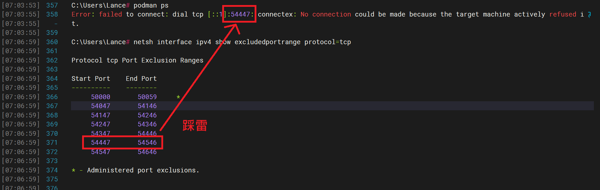

* 切換 podman 指令要連到的 machine
  ```
  podman system connection default machine-name
  ```
* podman with wsl2 不確定甚麼原因下會導致 podman machine 的 service port 無法 forwarding 到本機
  * ~~參考 https://jwstanly.com/blog/article/Port+Forwarding+WSL+2+to+Your+LAN/~~
  * ~~手動設定 port forwarding (Run as administrator)~~
    ```
    netsh interface portproxy add v4tov4 listenport=[PORT] listenaddress=0.0.0.0 connectport=[PORT] connectaddress=[WSL_IP]
    ```
  * 疑似是 Hyper-V 的問題，與 Windows NAT 服務有關
    
  
  * 重啟 Windows NAT 服務應可恢復正常
    ```
    # netsh interface ipv4 show excludedportrange protocol=tcp
    Protocol tcp Port Exclusion Ranges
    Start Port    End Port
    ----------    --------
         50000       50059     *
         54047       54146
         54147       54246
         54247       54346
         54347       54446
         54447       54546
         54547       54646
    * - Administered port exclusions.
    
    # net stop winnat
    The Windows NAT Driver service was stopped successfully.
    
    # net start winnat 
    The Windows NAT Driver service was started successfully.
    
    # netsh interface ipv4 show excludedportrange protocol=tcp
    Protocol tcp Port Exclusion Ranges
    Start Port    End Port
    ----------    --------
         50000       50059     *
    * - Administered port exclusions.
    ```    

